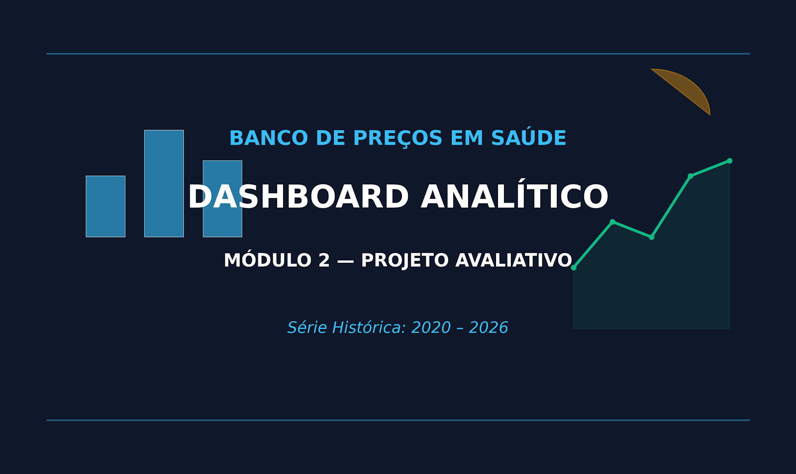
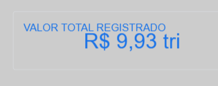
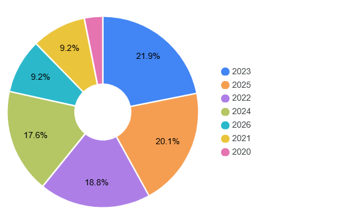
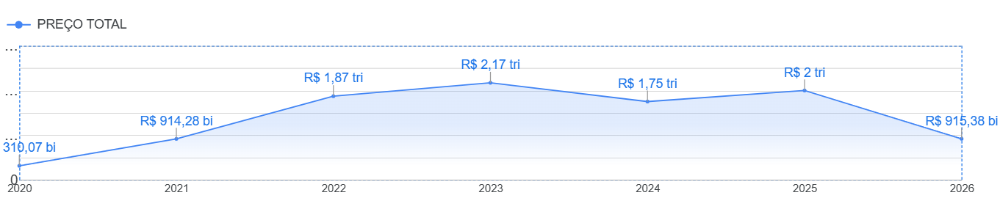
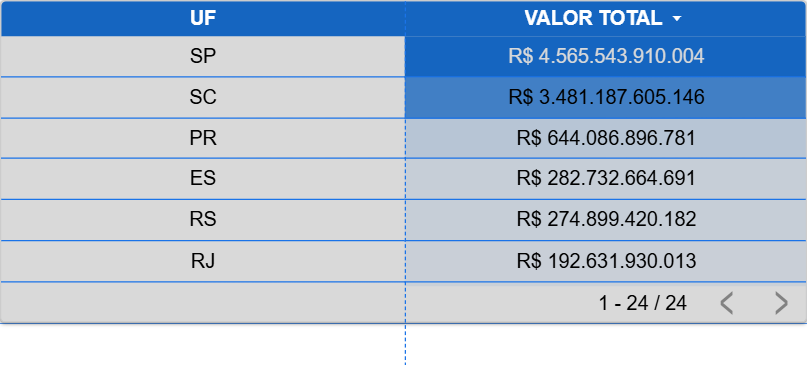
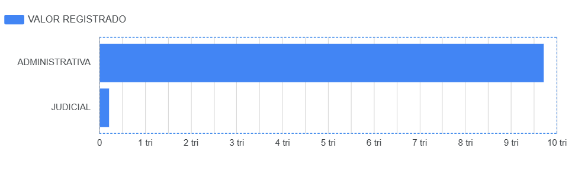
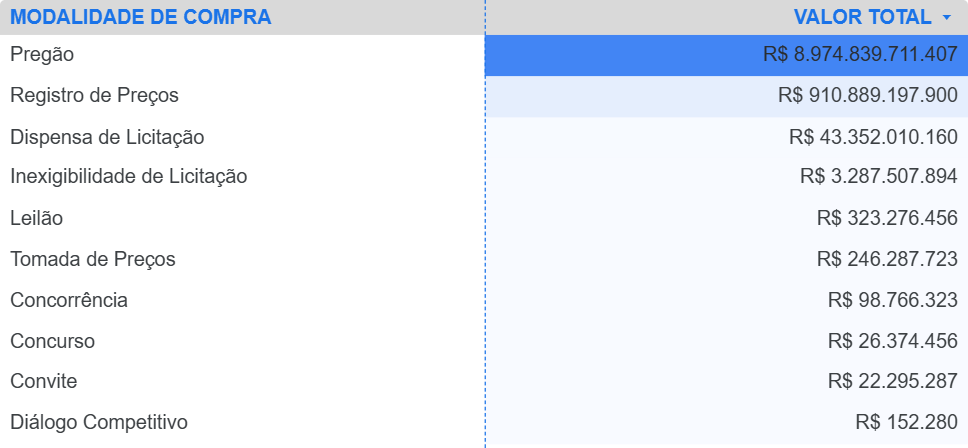
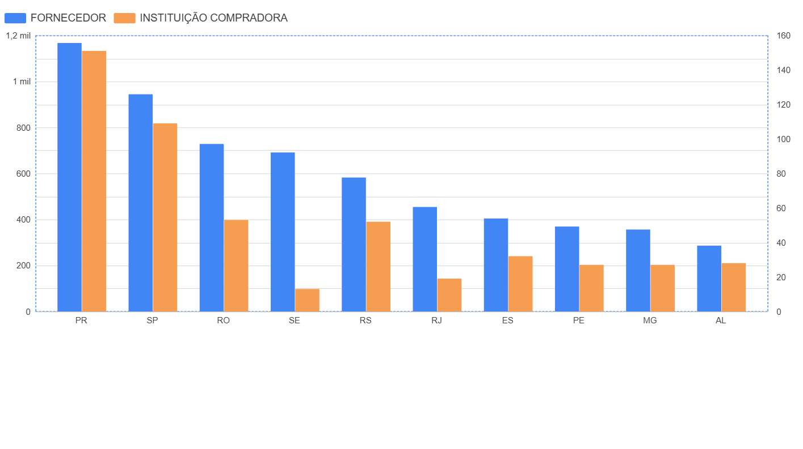

# Mini-Projeto Avaliativo: Visualização de Dados e Business Intelligence

**Módulo 2 - Semana 07**

## 👤 Identificação

* **Aluno:** Andreza Tatiane Nascimento dos Santos Cordeiro
* **Turma:** QA VDBI 2026/1 2
* **Mentor:** Rodrigo Garcia Brunini

## 📊 Dashboard Analítico do Banco de Preços em Saúde (BPS) 2020–2026

## 🎯 1. Objetivo do Projeto

Desenvolver uma solução analítica integrada de Visualização de Dados e Business Intelligence para acompanhar, monitorar e explorar as compras públicas de medicamentos e dispositivos médicos registradas no Banco de Preços em Saúde (BPS) entre os anos de 2020 e 2026. O projeto traduz grandes volumes de dados públicos do Ministério da Saúde em indicadores estratégicos, auxiliando no planejamento, controle e eficiência dos gastos públicos no setor da saúde.

## 🏛️ 2. Contextualização do Problema

A gestão eficiente dos recursos públicos na saúde enfrenta desafios complexos devido ao elevado volume financeiro, à pluralidade de fornecedores, às diversas modalidades licitatórias e à ampla variedade de produtos.

O Banco de Preços em Saúde (BPS) centraliza informações de compras públicas e privadas de medicamentos e dispositivos médicos para subsidiar entes federados e instituições de saúde em negociações mais vantajosas. Cabe ressaltar que variações de preços unitários não devem ser interpretadas de forma automatizada como sobrepreço ou irregularidades, pois refletem especificidades de fabricante, apresentação, escala, modalidade de compra e sazonalidade.

## 🔗 3. Fonte dos Dados

* **Plataforma:** Portal Brasileiro de Dados Abertos do Ministério da Saúde.
* **Base Utilizada:** Banco de Preços em Saúde — BPS (COGPS/CGCUSTOS/DESID/SE/MS).
* **Período Analisado:** Arquivos em formato `.csv` consolidados de 2020 a 2026.
* **Dicionário de Dados Oficial:** Dicionário do BPS — Dados Abertos.

## 🔄 4. Procedimentos de Download e Concatenação

- **Aquisição:** Download dos arquivos `.csv` anuais correspondentes ao período de 2020 a 2026 no URL [dadosabertos.saude.gov.br/dataset/bps](https://dadosabertos.saude.gov.br/dataset/bps).

* **Padronização:** Executada integralmente dentro do Power Query, compreendendo a uniformização de nomes de colunas, formatação de datas (campos `Compra` e `Inserção`), ajuste de tipos numéricos e tratamento de problemas de codificação de caracteres (*encoding* e acentuação).
* **Tratamento de Dados:** Identificação e expurgo de colunas desnecessárias, valores nulos ou registros duplicados realizados via Power Query.
* **Consolidação:** Empilhamento (*Append*) de todas as bases anuais em um único arquivo mestre histórico denominado `BPS_20_26_AndrezaTNCordeiro.csv` por meio do Power Query e posteriormente direcionando para montagem do dashboard no Data Studio (Looker).

## 📋 5. Descrição das Principais Colunas Utilizadas (Baseado no Dicionário Oficial)

* **Ano Compra:** Ano da compra informada pela instituição compradora.
* **Data de Compra / Data de Inserção:** Data da transação e data em que a instituição inseriu as informações no sistema.
* **Preço Total:** Preço unitário multiplicado pela quantidade de itens, representando o valor global da aquisição.
* **Qtd Itens Comprados:** Quantidade do item adquirida na transação.
* **Preço Unitário:** Valor pago por unidade do item adquirido, com base no valor efetivamente negociado.
* **UF / Município Instituição:** Unidade Federativa e município onde a instituição compradora está localizada.
* **Instituição Compradora :** Nome  da entidade compradora (hospitais, secretarias de saúde, etc.).
* **Fornecedor :** Nome da empresa responsável pela venda e entrega do produto.
* **Modalidade da Compra:** Tipo de procedimento licitatório ou formato jurídico utilizado (ex: Pregão, Dispensa, etc.).
* **Tipo de Compra:** Contexto ou natureza da aquisição (ex: regular, emergencial, etc.).
* **Código do item:** Identificador único e descrição padronizada do item conforme o Catálogo de Materiais.
* **Classe do Item:** Contexto ou natureza da utilização o material (ex: vestuário hospitalar, mobiliário, equipamentos, utensílios e etc)
* 

## 📐 6. Definição dos KPIs e Métricas (Valores Consolidados do Painel)

O dashboard foi estruturado contemplando os indicadores estratégicos mínimos exigidos, refletindo os seguintes totais consolidados no período:

* **Valor Total Registrado:** R$ 9,93 trilhões (Soma geral do campo `Preço Total`).
* **Quantidade Total de Itens Comprados:** 64.810.881.531 unidades (`Qtd Itens Comprados`).
* **Quantidade Total de Compras (Registros):** 367.570 transações.
* **Quantidade de Tipos de Itens:** 13.514 variações de produtos distintos (`Código BR`).
* **Contagem de Fornecedores / Instituições:** 367.570 registros mapeados.
* **Preço Médio Ponderado:** R$ 27,02 milhões (Relação agregada entre o volume financeiro e as quantidades transacionadas).

Ex:



## 🖼️ 7. Visualizações do Dashboard

O painel interativo conta com filtros dinâmicos ( Ano ,  *Mês* ,  *UF* ,  Comprador ,  *Fornecedor* ,  Seleção por período, Código do Item, Tipo de Compra  e  Classe do Item ) e exibe as seguintes visualizações principais:

- O gráfico de pizza integrado ao **Dashboard Analítico do BPS (2020–2026)** tem como principal objetivo fornecer uma visão macro e percentual da composição dos dados de preços em saúde ao longo da série histórica. Permite acompanhar como a proporção entre os diferentes segmentos evoluiu ano a ano, destacando mudanças de comportamento até 2026.



* **Evolução de Valores Registrados em Compras (Série Temporal):** Gráfico de linhas demonstrando a oscilação anual do montante financeiro (`Preço Total` por  *Ano Compra* ):

  * **2020:** R$ 310,07 bilhões
  * **2021:** R$ 914,28 bilhões
  * **2022:** R$ 1,87 trilhão
  * **2023:** R$ 2,17 trilhões (Pico da série - 21,9%)
  * **2024:** R$ 1,75 trilhão (17,6%)
  * **2025:** R$ 2,00 trilhões (20,1%)
  * **2026:** R$ 915,38 bilhões (9,2%)



* **Valor Total por UF (Ranking dos Principais Estados):**

  * **SC (Santa Catarina):** R$ 4.565.543.910.004
  * **SP (São Paulo):** R$ 3.481.187.605.146
  * **PR (Paraná):** R$ 644.086.896.781
  * **ES (Espírito Santo):** R$ 282.732.664.691
  * **RS (Rio Grande do Sul):** R$ 274.899.420.182
  * **RJ (Rio de Janeiro):** R$ 192.631.930.013
  * **AL (Alagoas):** R$ 181.139.813.615



**Valor Total por Tipo de Compra:**

* * **Regular/Administrativa:** Representa a esmagadora maioria dos recursos (próximo de R$ 9,9 trilhões).
  * **Judicial:** Expressa em menor escala no volume global comparativo.



* **Modalidades de Compra mais Utilizadas:**
  * **Pregão:** R$ 8.974.839.711.407
  * **Registro de Preços:** R$ 910.889.197.900
  * **Dispensa de Licitação:** R$ 43.352.010.160
  * **Demais modalidades***:*** Inexigibilidade, Leilão, Tomada de Preços, Concorrência, Concurso, Convite e Diálogo Competitivo.



* **Instituições Compradoras e Fornecedores por UF:** Gráfico de colunas comparando o volume de atuação e capilaridade dos fornecedores e instituições nas principais Unidades Federativas (com destaque expressivo para PR, SP, RO, RS e ES).



## 📈 8. Principais Análises e Descobertas

* **Concentração Econômica:** Os estados de Santa Catarina (SC) e São Paulo (SP) lideram isoladamente o volume financeiro acumulado de aquisições de saúde no país entre 2020 e 2026.
* **Pico de Aquisições em 2023:** O ano de 2023 concentrou o maior volume de recursos aplicados da série histórica (R$ 2,17 trilhões ou 21,9% do total), seguido de perto por 2025 (20,1%).
* **Predominância do Pregão:** A modalidade de Pregão consolida-se como o mecanismo principal de contratação pública, respondendo por quase 90% do total movimentado.

## 💡 9. Recomendações Baseadas nos Dados

* **Benchmarking de Preços Unitários:** Utilizar a mediana e o preço médio ponderado segmentado por região e por *Unidade de Fornecimento* para subsidiar novas negociações e evitar distorções em compras futuras.
* **Governança de Dados:** Estimular os entes municipais e estaduais a padronizarem o preenchimento tempestivo no BPS, reduzindo assimetrias informacionais entre os estados.

## ⚠️ 10. Limitações Identificadas

* **Fator de Conversão de Unidades:** Variações acentuadas nas unidades de fornecimento (caixas, ampolas, frascos combinados à  *Capacidade* ) de certos medicamentos podem gerar distorções pontuais se comparadas de forma linear sem o devido tratamento de normalização.
* **Subnotificação:** Os dados refletem exclusivamente os registros informados pelas instituições compradoras ao sistema público do BPS^^, podendo existir lacunas em determinados municípios ou períodos.

## 🚀 11. Instruções para Reprodução do Projeto

1. Clone o repositório em sua máquina:
   **Bash**

   ```
   git clone https://github.com/seu-usuario/seu-repositorio.git
   ```
2. Execute a rotina de tratamento e concatenação dos `.csv` anuais (2020–2026) gerando a base unificada `BPS_20_26_AndrezaTNCordeiro.csv`.
3. Conecte o arquivo consolidado ao Looker Studio.
4. Configure os campos calculados de KPIs descritos na seção 6 e organize os visuais interativos.

## 🎥 12. Apresentação em Vídeo e link do Dashboard.

* **Link da Apresentação (Até 5 minutos): [[drive.google.com/file/d/1UAv_HBbT73Rc-smDNN6QUT7jan_HLHZi/view?usp=sharing](https://drive.google.com/file/d/1UAv_HBbT73Rc-smDNN6QUT7jan_HLHZi/view?usp=sharing)]**
* **Link do Dashboard (Looker Studio): [[datastudio.google.com/reporting/4c3b366c-2045-4c46-a3a7-e6058c634981](https://datastudio.google.com/reporting/4c3b366c-2045-4c46-a3a7-e6058c634981)]**
